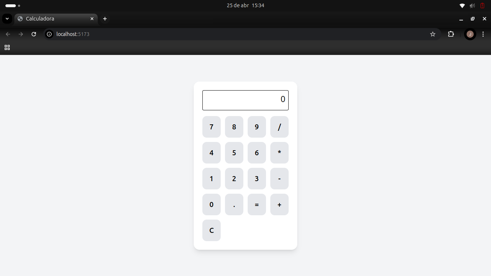
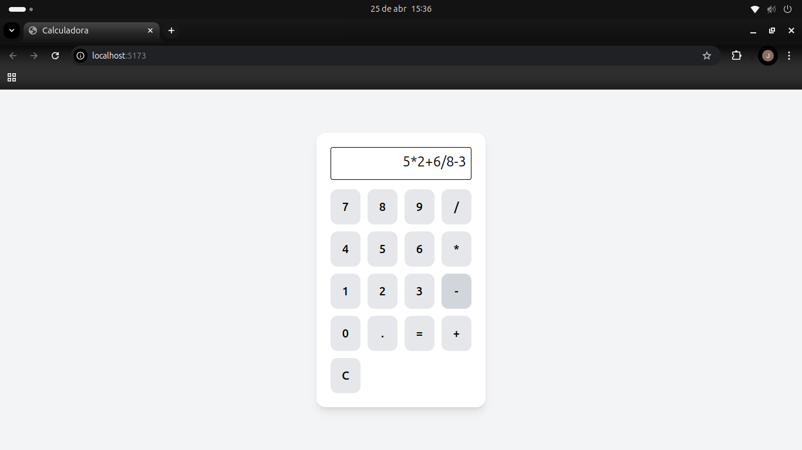
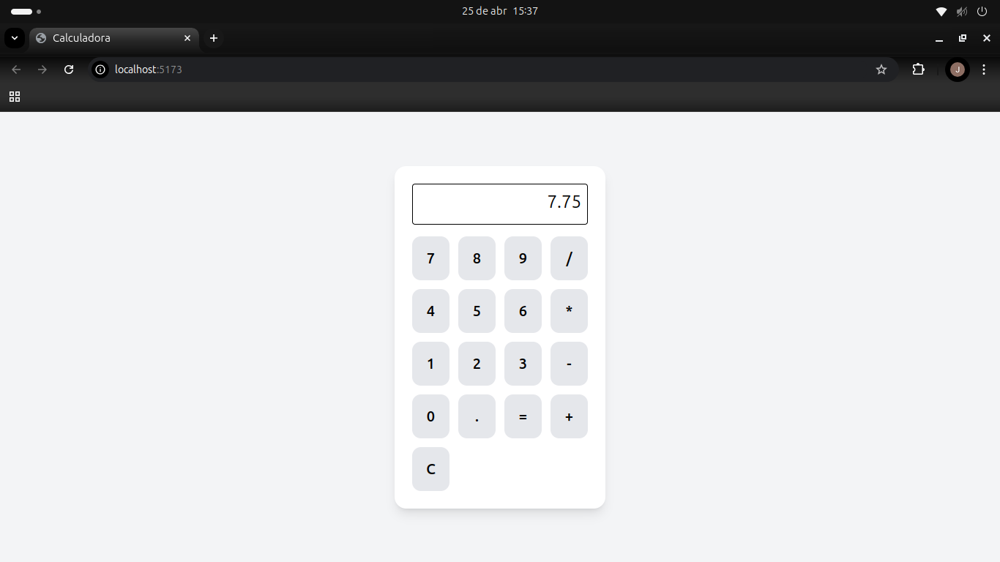

# 🧮 Calculadora React

Este é meu **1º projeto em React**!  
Uma calculadora simples desenvolvida com **React + Tailwind CSS**.

---

## 🚀 Tecnologias utilizadas

- [React](https://reactjs.org/)
- [Vite](https://vitejs.dev/)
- [Tailwind CSS](https://tailwindcss.com/)

---

## 📸 Imagens

### Inicio

### Inserindo valores no Display

### Resultado operação

---

## 🔧 Funcionalidades

- Operações básicas: adição, subtração, multiplicação e divisão
- Botão de limpar (`C`)
- Avaliação da expressão com `=`
- Interface responsiva com estilo limpo usando Tailwind CSS

---

## ▶️ Como rodar

1. Clone o repositório:
    
    git clone https://github.com/JoaoToledo18/Primeiro-Projeto-React-Calculadora-.git

2. Acesse o diretório do projeto:

    cd Primeiro-Projeto-React-Calculadora

3. Instale as dependências:

    npm install

4. Inicie o servidor de desenvolvimento:

    npm run dev

---

## 📚 Aprendizados

- Primeiros passos com **React**
- Uso do hook **useState** para gerenciar o estado da aplicação
- Manipulação de eventos com **JSX**
- Aplicação de **Tailwind CSS** para estilização rápida e responsiva

## 👨‍💻 Autor

**João Vitor Toledo da Silva**  
📧 joaovtsilva5a@gmail.com  
[LinkedIn](www.linkedin.com/in/joaovitortoledo)  
[GitHub](https://github.com/JoaoToledo18)

---

Obrigado por conferir este projeto! 